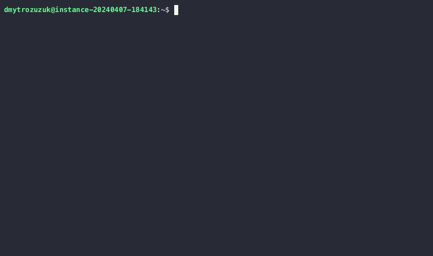

# Agenda
Сomparative analysis of Kubernetes cluster deployment tools on a local environment Minikube, Kind, and K3d
# Introduction
### Depiction of tools and purpose

| | Minikube | Kind  | K3d |
|------------|-----------|----------|--------|
| Purpose  | Lightweight and manageable Kubernetes environment on a single machine | Tool for running local Kubernetes clusters using Docker | Lightweight wrapper to run Kubernetes clusters in Docker |
| Configuration | Uses command-line options and configuration files | Uses YAML configuration files for cluster setup | Uses command-line options and flags for cluster setup |
| Performance | Depends on the underlying hypervisor and resources | Typically slower due to containerd usage | Generally faster due to Docker usage |
| Cluster Setup	| Uses virtualization (e.g., VirtualBox, KVM, HyperKit) | Uses containerd as the container runtime | Uses Docker as the container runtime|	
| Use Cases | Suitable for testing, development, and production use | 	Suitable for testing and development environments |	Suitable for testing, development, and CI/CD environments	

### Сharacteristics
| | Minikube | Kind  | K3d |
|------------|-----------|----------|--------|
| Supported OS and Architecture | Windows, macOS, and Linux. Compatible with various architectures, including amd64, arm64 | Compatible with Linux, macOS, and Windows (with limitations). Works on amd64 architecture | Primarily designed for Linux but also supports macOS and Windows. Works on amd64 architecture |
| User-Friendliness | Designed to be beginner-friendly with simple setup and management commands. Suitable for developers and users who want a quick and easy way to run Kubernetes locally | Offers a lightweight and straightforward way to create Kubernetes clusters using Docker containers. Command-line interface is intuitive and easy to use | Built for simplicity and speed, providing a fast way to spin up Kubernetes clusters using Docker. Offers a user-friendly CLI for cluster creation and management |
| Automation Possibilities | Supports automation through scripting and provisioning tools like Ansible or Terraform. Provides command-line options for automating cluster setup and configuration | Can be automated using shell scripts or configuration management tools. Offers command-line options for cluster creation and configuration | Automation is possible through scripting or integration with CI/CD pipelines. Provides CLI options for creating and managing clusters programmatically |
| Monitoring Possibilities | Supports integration with monitoring tools like Prometheus and Grafana for cluster monitoring. Users can install and configure monitoring solutions within the Minikube cluster | Monitoring capabilities depend on external tools and integrations. Users can set up monitoring solutions within the Kubernetes clusters created by Kind | Monitoring capabilities rely on external tools and integrations. Users can install and configure monitoring solutions within K3d-managed Kubernetes clusters |
| Cluster Management | Provides basic cluster management features for starting, stopping, and deleting clusters. Supports configuration options for customizing cluster settings | Primarily focused on creating lightweight Kubernetes clusters for testing and development purposes. Offers commands for cluster creation, deletion, and management | Designed for fast and efficient cluster management, enabling users to create, delete, and manage Kubernetes clusters easily from the command line. Supports configuration options for cluster customization |

### Pros & Cons
<table>
  <tr>
    <th>Tool</th>
    <th style="text-align:center">Pros</th>
    <th style="text-align:center">Cons</th>
  </tr>
  <tr>
    <td>Minikube</td>
    <td>
      <ul>
        <li>Easy to set up and use</li>
        <li>Good for local development and testing</li>
        <li>Supports various OS and architectures</li>
        <li>Provides a dashboard for cluster management</li>
      </ul>
    </td>
    <td>
      <ul>
        <li>Resource-intensive for running large clusters</li>
        <li>Can be slow to start up</li>
        <li>Limited scalability</li>
      </ul>
    </td>
  </tr>
  <tr>
    <td>Kind</td>
    <td>
      <ul>
        <li>Lightweight and fast</li>
        <li>Good for testing Kubernetes features locally</li>
        <li>Easy to integrate with CI/CD pipelines</li>
        <li>Supports containerd as a container runtime</li>
      </ul>
    </td>
    <td>
      <ul>
        <li>Limited to single-node clusters</li>
        <li>No GUI or dashboard</li>
        <li>Limited support for multi-node clusters</li>
      </ul>
    </td>
  </tr>
  <tr>
    <td>K3d</td>
    <td>
      <ul>
        <li>Lightweight and fast</li>
        <li>Easy to set up and manage clusters</li>
        <li>Supports multi-node clusters</li>
        <li>Provides built-in support for private registries</li>
      </ul>
    </td>
    <td>
      <ul>
        <li>Limited to single-node clusters</li>
        <li>Less mature compared to Minikube and Kind</li>
        <li>No built-in support for CI/CD integration</li>
      </ul>
    </td>
  </tr>
</table>

### Demo
## Minikube

## Kind

## K3D

# Conclusions
In summary, Minikube is great for local development and testing, while Kind and K3d offer lightweight alternatives with Docker-based clusters. The choice depends on your specific use case and requirements, such as scalability, feature support, and ease of setup
